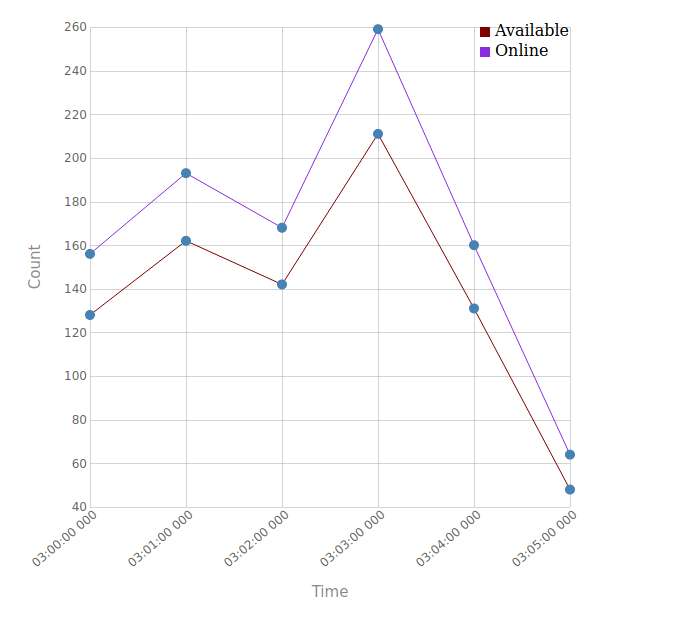

**Software versions:**

1. Spark - 3.0.0-preview2
2. KafkaUtils - Streaming app between spark and kafka
3. Scala - 2.12
4. sbt

Built this code with reference from : `https://spark.apache.org/docs/1.6.3/streaming-kafka-integration.html`

`Goals:`
Live data being pushed from user mobile to kafka.
Use streaming apps to report the people online and people available in last `n minutes`

Next Steps:
1. ~~Persist the counts to DB, alongwith time, to create trends~~
2. Maintain a map so that late-arriving health pings are accounted for in the reports

Docker Images and setup:
1. sudo docker pull mongo
2. sudo docker run --name mongo-dev -d mongo:latest

For idempotent pipelines, refer : https://spark.apache.org/docs/latest/streaming-kafka-0-10-integration.html#kafka-itself

    In the direct stream approach, spark-kafka stream will create 1 RDD
    for each partition of the topic.
    Hence, we can simply save the max(offset) for a given topic and 
    partition in mongo collection.
    This offset will be used in the next streaming context startup, 
    if the app crashes
   
*Common Errors and Fixes:*
1. Kafka network issues; check that the `kafka-python` entry is valid in /etc/hosts of executor-machine and kafka-docker
Kafka docker machine should have /etc/hosts like this :
```
    127.0.0.1	localhost
    ::1	localhost ip6-localhost ip6-loopback
    fe00::0	ip6-localnet
    ff00::0	ip6-mcastprefix
    ff02::1	ip6-allnodes
    ff02::2	ip6-allrouters
    172.18.0.3    kafka-python
```

To rerun after mongodb cleanup:
```
   > db.kafka_meta_table.remove({})
   WriteResult({ "nRemoved" : 1 })
   > db.report_summary.remove({})
   WriteResult({ "nRemoved" : 6 })   
``` 

Now change the consumer-group in application.conf and rerun

**How to Run the Job on spark master:**
1. sudo docker pull bitnami/spark
2. sudo docker run --name spark bitnami/spark:latest
3. spark-submit --class "Main" --master spark://spark:7077 target/scala-2.12/coursera-assembly-0.1.jar

You will see output messages like below:
```
Existing DB Record for 2018-01-01 04:00:00 : { "_id" : { "$oid" : "5ec95b452c529323a53c3512"} , "timeBucket" : "2018-01-01 04:00:00" , "driversAvailableCount" : 417 , "driversOnlineCount" : 505}
saving the offsetTopicOffset(lalamove-test-1,0,3034)
timestamp : 2018-01-01 04:00:00| total_online_drivers : 506 | available_drivers : 4
```

The offset is being saved in a meta table:
```
> db.kafka_meta_table.find()
{ "_id" : ObjectId("5ec95b452c529323a53c3514"), "partition" : 0, "topic" : "lalamove-test-1", "offset" : NumberLong(3034) }

```
The records are also being `upserted` to mongodb colleciton:
```
> db.report_summary.find()
{ "_id" : ObjectId("5ec95b452c529323a53c3512"), "timeBucket" : "2018-01-01 04:00:00", "driversAvailableCount" : 420, "driversOnlineCount" : 508 }
{ "_id" : ObjectId("5ec95b452c529323a53c3517"), "timeBucket" : "2018-01-01 04:01:00", "driversAvailableCount" : 486, "driversOnlineCount" : 579 }
{ "_id" : ObjectId("5ec95b452c529323a53c351b"), "timeBucket" : "2018-01-01 04:02:00", "driversAvailableCount" : 426, "driversOnlineCount" : 504 }
{ "_id" : ObjectId("5ec95b452c529323a53c351f"), "timeBucket" : "2018-01-01 04:03:00", "driversAvailableCount" : 633, "driversOnlineCount" : 777 }
{ "_id" : ObjectId("5ec95b452c529323a53c3523"), "timeBucket" : "2018-01-01 04:04:00", "driversAvailableCount" : 393, "driversOnlineCount" : 480 }
{ "_id" : ObjectId("5ec95b452c529323a53c3527"), "timeBucket" : "2018-01-01 04:05:00", "driversAvailableCount" : 144, "driversOnlineCount" : 192 }
```

*Notes about  how to package using docker*
1. Create a dockerfile. Some points to note:
* the `docker-entrypoint.sh` script should have `exec "$@"` in it. This allows 
us to set name and hostname. Else, we will get `docker: Error response from daemon: OCI runtime create failed: container_linux.go:348: starting container process caused “exec: “` error.

2. Use a `--name` and `--hostname` so that your docker image us identifiable
3. Next you build the image using :
```aidl
sudo docker build --tag my-submission:v1.0 ~/interviews/lalamove/
```
4. Now run the image:
```aidl
training@training-VirtualBox:~/interviews/lalamove$ sudo docker run -d -i -t --name assignment_codes my-submission:v1.0 
ffbd888f47ee2260f99f2ddc2c0328b9a21e81214c8b7f0015e330e92ea416b2
training@training-VirtualBox:~/interviews/lalamove$ sudo docker ps -a
CONTAINER ID        IMAGE                    COMMAND                  CREATED             STATUS                     PORTS                                                NAMES
ffbd888f47ee        my-submission:v1.0       "docker-entrypoint.s…"   5 seconds ago       Up 4 seconds                                                                    assignment_codes
03d629992464        my-submission:v1.0       "docker-entrypoint.s…"   4 minutes ago       Exited (2) 4 minutes ago                                                        busy_panini
4f983f717405        b19308fdaf7d             "/bin/sh -c 'chmod +…"   8 minutes ago       Exited (1) 8 minutes ago                                                        affectionate_almeida
c1fadfa46d82        bitnami/spark:latest     "/opt/bitnami/script…"   19 hours ago        Up 19 hours                                                                     spark
d8f8221cc741        mongo:latest             "docker-entrypoint.s…"   4 days ago          Up 24 hours                27017/tcp                                            mongo-dev
5c5f502b7a78        kafka-docker_kafka       "start-kafka.sh"         7 days ago          Up 24 hours                0.0.0.0:32768->9092/tcp                              kafka-docker_kafka_1
90ddf2fb0bf2        wurstmeister/zookeeper   "/bin/sh -c '/usr/sb…"   7 days ago          Up 24 hours                22/tcp, 2888/tcp, 3888/tcp, 0.0.0.0:2181->2181/tcp   kafka-docker_zookeeper_1

```

#Issues:
Common issues observed in spark-kafka-streaming:
1. `Offsets out of range with no configured reset policy for partitions` - This happens if the offset requested by spark has been purged by kafka due to `kafka.retention.policy` . The solution is to start using a new topic, upgrade the producer and consumer configs accordingly. Setting the `kafka.offset.reset = "latest"` does not solve the problem ( Spark/kafka bug)

Sample Visualization of the Available vs Online Drivers :
